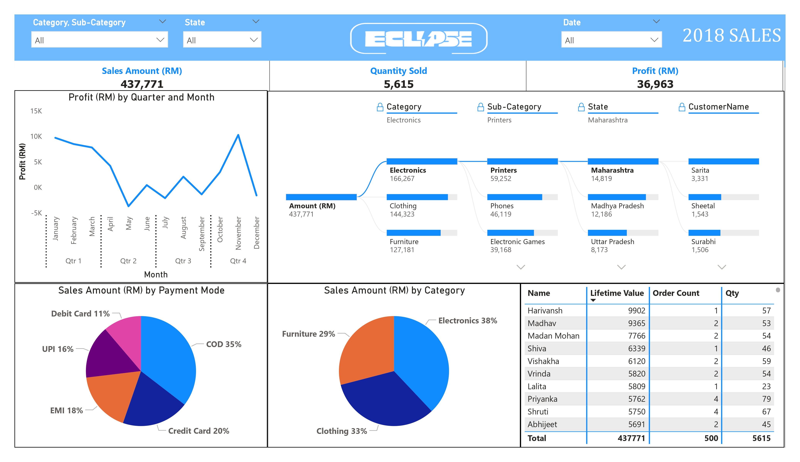

# 📊 Sales Performance Dashboard

This project is a sales analytics dashboard built using **Microsoft Excel** and **Power BI**. It visualizes sales performance by time, product category, customer behavior, and location using an interactive dashboard.

## 🗂 Project Structure

- `data/Details-Orders.xlsx` – Merged dataset combining order and transaction details
- `pbix_dashboard/sales-performance.pbix` – Power BI dashboard (open with Power BI Desktop)
- `visuals/dashboard.jpg` – Snapshot of the final dashboard
- `visuals/dashboard-demo.mp4` – Demo of the final dashboard
- `Insights.md` – Detailed analysis and business insights

## 📊 Key Metrics

- **Total Sales**: RM 437,771  
- **Total Profit**: RM 36,963  
- **Total Orders**: 500  
- **Total Quantity Sold**: 5,615 units  
- **Average Order Value**: RM 875.54  
- **Most Used Payment Mode**: Cash on Delivery (35%)

## 💡 Highlights

- 📈 Seasonal profit spikes (November highest, May lowest)  
- 🛍 Top category: Electronics (38%)  
- 📍 Highest sales states: Madhya Pradesh, Uttar Pradesh  
- 👥 336 unique customers — mostly 1-time buyers  

## 🧰 Tools Used

- **Excel** – Data merging and cleaning  
- **Power BI Desktop** – Dashboard design and visualization  

---

> Feel free to clone this repo or adapt it for your own sales projects!
